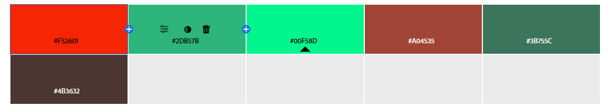

# README

## Christopher Urban

### Netlify Badge

## Description
This website was a learning experience and test of my growing set of web development skills. 

I learned about anchor-links and used them to make a Nav bar. Using unordered and ordered lists to create buttons that can take you to any of the major topics of the page instantly.

I learned how to embed files into a webpage to display images and videos, as seen in the gallery and blog. I got to learn about the many tags that go along side them as well. Placing alt text on the images so the viewers can know what the image is supposed to be if it cannot be loaded or if the viewer cannot see it. 

I learned about styling in CSS and designed the website according to my color swatch and design documentation. I got to learn about specificity rankings and ensuring that the order of the CSS is layered correctly for the desired presentation.

I formatted the website for smart phones, tablets, and desktop screens using media screen states. I inserted a Hamburger menu for smart phones and Tablets to consolidate the navbar for viewers.

The gallery and blog taught me the most about the concept of "The Box", how it works, and when to break it for design purposes. I learned about flex and box display, inline elements, and the grid, all of which are utilized in the webpage to help the format stay consistent.

I also learned about forms and proper form submission practices which are utilized in the ConTact Me at the bottom of the page. I used many different input types and labels, as well as doing some backend work to ensure that submitted forms are processed correctly on the server-side.

Finally, the blog itself was about image hover effects and I demonstrated many common effects and methods of image hovering. Using filters, transitions, and keyframing to get special effects of all kinds to showcase what is possible using CSS. 

## Color Swatch

This webpage follows the preceding color codes for its design. 

The greens are used to block out the divided sections of the webpage through background colors. The mint green as one exception, when it is being used as the font of elements using the dark brown as the background. 

The brown is used to denote interactive elements such as the buttons of the navbar or the submission button of the contact form. It is also used as the base font color for optimal contrast. 

Finally the orange is utilized for header backgrounds and border colors to cleanly mark different sections of the page alongside the shades of green. This can be best visualized from the beginning of the webpage.

These colors were chosen for their high contrast with each other, so viewers have optimal legibility. This can be seen with the site logo at the top of the README.

## Citations
Hover Effect Demos: https://codepen.io/nxworld/pen/ZYNOBZ

Basic Overlay: https://www.w3schools.com/howto/howto_css_image_overlay.asp

MDN Filter Guide: https://developer.mozilla.org/en-US/docs/Web/CSS/filter 

## Liscense
Rights Reserved